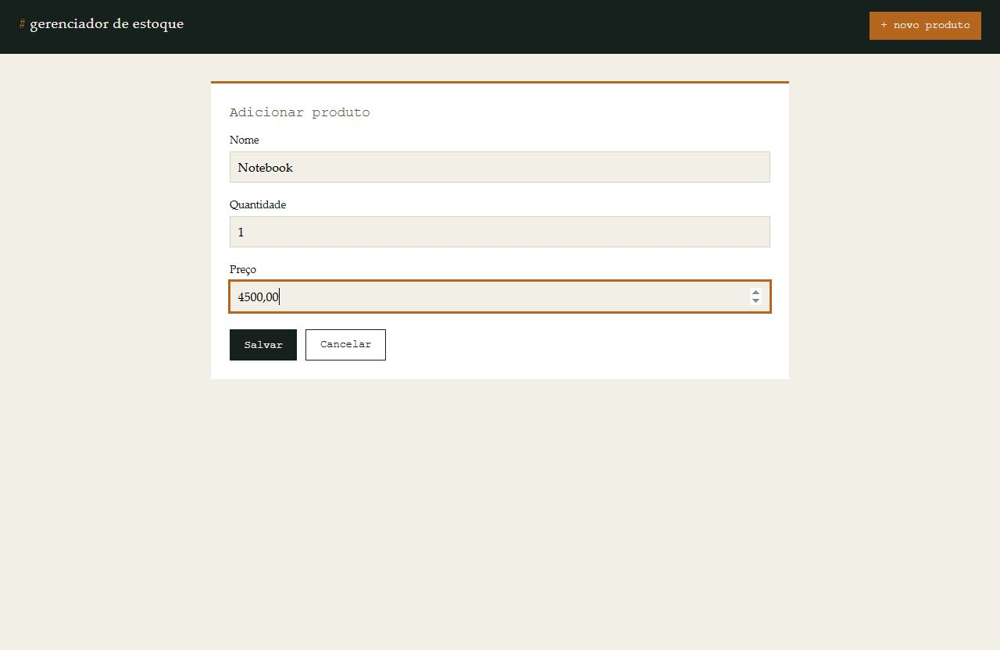
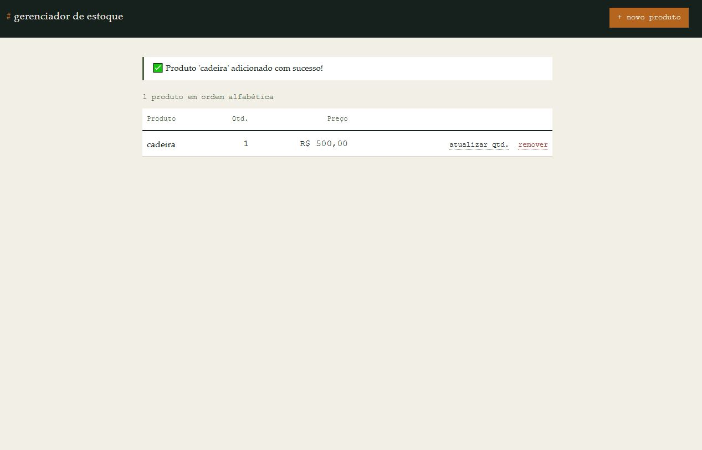

# 📦 Gerenciador de Estoque (Django)

Sistema web para gerenciar o inventário de produtos, evoluído a partir de uma versão CLI em Python puro. Agora usa **Django** com banco de dados, painel administrativo e interface web para cadastrar, listar, atualizar e remover produtos.

---
## 📸 Capturas de tela

| Cadastro de produto | Produto adicionado com sucesso |
|---|---|
|  |  |

## 🚀 Funcionalidades

* **Adicionar Produto:** cadastra nome, quantidade e preço via formulário web.
* **Listar Produtos:** exibe todos os itens em ordem alfabética.
* **Remover Produto:** exclui um item do estoque, com tela de confirmação.
* **Atualizar Estoque:** altera a quantidade de um produto já cadastrado.
* **Validação de dados:** feita pelos formulários do Django (nomes únicos, quantidade e preço não-negativos).
* **Painel administrativo:** `/admin/` para gerenciar produtos com busca e filtros.

---

## 🛠️ Tecnologias Utilizadas

* [Python 3.13+](https://www.python.org/)
* [Django 5.x](https://www.djangoproject.com/)
* [Poetry](https://python-poetry.org/) (gerenciamento de dependências)
* SQLite (banco de dados padrão de desenvolvimento)

---

## 📋 Pré-requisitos

1. **Python 3.13+**
2. **Poetry** ([instruções de instalação](https://python-poetry.org/docs/#installation))

---

## 🔧 Instalação e Execução

1. **Instale as dependências:**
```bash
poetry lock
poetry install
```

2. **Aplique as migrações do banco de dados:**
```bash
poetry run python manage.py migrate
```

3. **(Opcional) Crie um super usuário para acessar o painel admin:**
```bash
poetry run python manage.py createsuperuser
```

4. **Execute o servidor de desenvolvimento:**
```bash
poetry run python manage.py runserver
```

5. Acesse no navegador:
   * App: http://127.0.0.1:8000/
   * Admin: http://127.0.0.1:8000/admin/

---

## 📝 Estrutura do Projeto

```
gerenciar_estoque-main/
├── manage.py
├── config/            # Configurações do projeto Django (settings, urls)
├── estoque/           # App principal: model Produto, views, forms, templates
│   ├── models.py      # Model Produto (nome, quantidade, preço)
│   ├── forms.py       # ProdutoForm e AtualizarQuantidadeForm
│   ├── views.py       # Views baseadas em classe (List/Create/Update/Delete)
│   ├── urls.py
│   ├── admin.py
│   ├── tests.py
│   └── templates/estoque/
├── templates/base.html
├── static/css/estoque.css
└── main.py            # Versão CLI original, mantida como referência histórica
```

### Modelo de dados

O antigo dicionário aninhado da versão CLI...

```python
estoque = {
    "Notebook": {"quantidade": 5, "preco": 3500.00},
}
```

...agora é um model Django persistido em banco de dados:

```python
class Produto(models.Model):
    nome = models.CharField(max_length=150, unique=True)
    quantidade = models.PositiveIntegerField(default=0)
    preco = models.DecimalField(max_digits=10, decimal_places=2)
```

---

## ✅ Rodando os testes

```bash
poetry run python manage.py test
```

---

## 📼 Versão CLI original

O arquivo `main.py` na raiz do projeto contém a versão original, em linha de comando, mantida apenas como referência histórica do projeto antes da migração para Django.

---

## 🤝 Contribuindo

1. Faça um **Fork** do projeto.
2. Crie uma **Branch** para sua modificação (`git checkout -b feature/nova-funcionalidade`).
3. Faça o **Commit** (`git commit -m 'Adicionando nova funcionalidade'`).
4. **Push** para a Branch (`git push origin feature/nova-funcionalidade`).
5. Abra um **Pull Request**.
